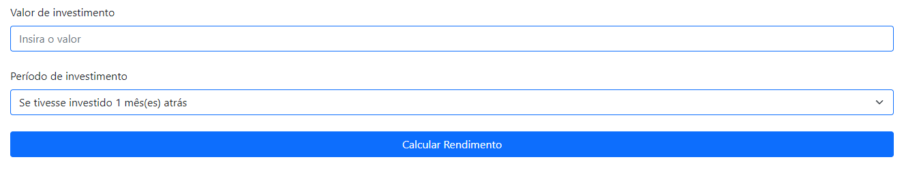
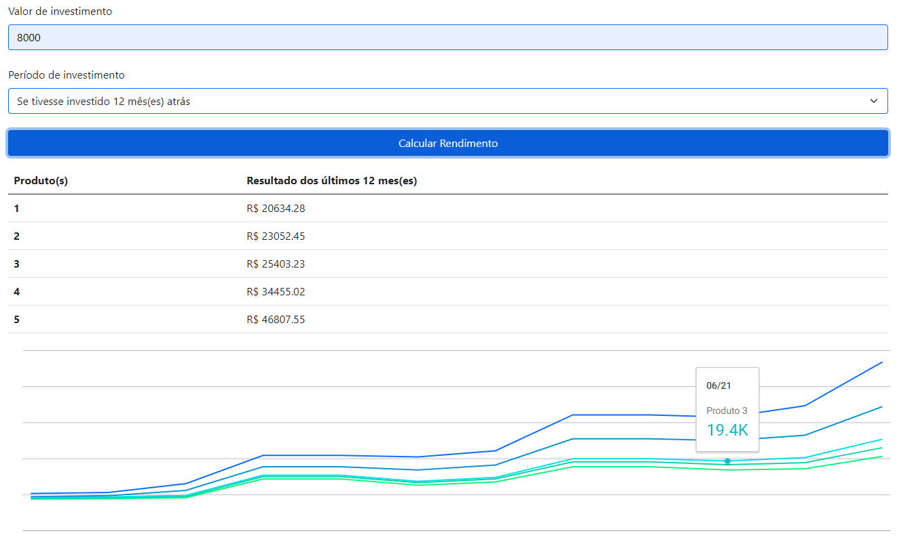
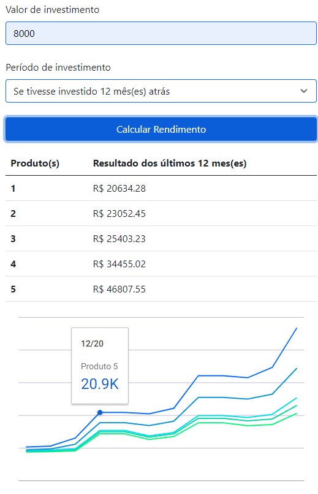

<h2 align="center">
  Aplicação Calculadora de Investimentos
</h2>

 <a href="#-sobre-o-projeto">Sobre</a> •
 <a href="#-tecnologias">Tecnologias</a> •
 <a href="#-site">Site</a> • 
 <a href="#-rodando-a-calculadora">Rodando a calculadora</a> • 
 <a href="#-responsivo">Responsivo</a> • 
 <a href="#-como-executar">Executar</a> 

## 💻 Sobre o projeto

É uma aplicação web que serve para calcular o rendimento que você poderia ter conseguido se tivesse investido em um x periodo. Para ligar o front-end com o back-end, foi utilizado o Ajax. A aplicação usa no backend PHP, aonde recebe os dados do valor e do periodo, trata e realiza todo o calculo do rendimento mês a mês com base um Json. Nesse Json temos o mês e a taxa de cada um dos produtos. Após isso, ele retorna para o front-end um Json que é tratado e trás o resultado por meio de uma tabela e um gráfico mostrando mês a mês.

---

## 🛠 Tecnologias

As seguintes ferramentas foram usadas na construção do projeto:

-   **HTML5**
-   **CSS3**
-   -    **Bootstrap**
-   **JavaScript**
-   -    **Ajax**
-   -    **Google Charts**
-   **PHP**

## 🚀 Site

  

## 🚀 Rodando a calculadora

Eu coloco o valor do investimento e depois o periodo, podendo escolher de 1 a 12 meses e clico para calcular. Vai trazer uma tabela com 5 produtos, quando você teria ganhado se tivesse investido esse valor naquele periodo. Em baixo, trás um gráfico mostrando mês a mês.

  

## 🚀 Responsivo

  

---

## 🛠 COMO EXECUTAR

Basta baixar os arquivos e rodar usando o Xamp ou o Wamp.

